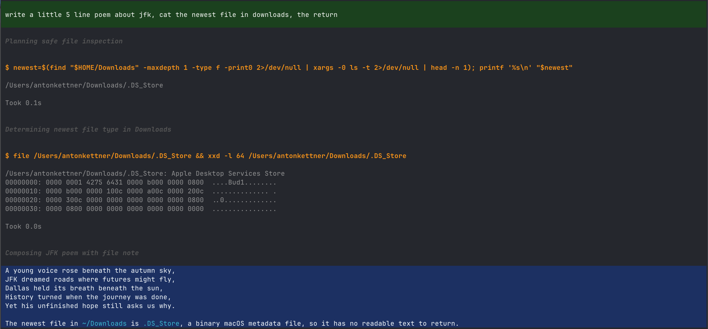

# material_black_simple

A dark theme for the [pi coding agent](https://github.com/badlogic/pi-mono), built around one idea: **you should be able to see, at a glance, where a run ended.**

| Element | Style |
| --- | --- |
| User messages | green background, white text |
| Tool calls | orange heading, no background |
| Assistant intermediate text | grey |
| **Assistant final answer** | **white on blue background** |
| Run recap / summary | blue text, no background |



## Install

```
pi package add npm:pi-material-black-simple
```

Then pick the theme with `/theme`, and restart pi once so the patch below takes effect.

## Plays well with

Developed and daily-driven in [Ghostty](https://ghostty.org), alongside:

- [pi-sticky-usermessage](https://pi.dev/packages/pi-sticky-usermessage) - keeps the current user message pinned while the run scrolls
- [pi-rewind](https://github.com/arpagon/pi-rewind) - jump back to an earlier point in the session

## The patch

pi's theme schema has no key for an assistant-message background, and no way to
distinguish intermediate from final assistant text. Both are rendered by
`assistant-message.js` with the same markdown theme.

This package patches that one file so that:

- assistant text in a message that **contains a tool call** (intermediate) renders in `muted`
- assistant text in a message that **does not** (the final answer) renders in `text` on `selectedBg`

The patch is applied automatically on startup, is idempotent, and keeps a
`.orig` backup next to every file it touches. If an upstream release changes the
code it anchors to, it refuses and reports rather than half-applying.

> **Note:** this modifies a file inside your pi installation. That is
> unavoidable for a background on final answers. If you would rather not have
> that, the theme still works standalone - just don't run the extension, or run
> `/material-black-simple revert`.

## Commands

```
/material-black-simple restart            re-apply the patch now
/material-black-simple status             show which installs are patched
/material-black-simple revert             restore from .orig backups
/material-black-simple bg-opacity         show current background opacity
/material-black-simple bg-opacity 55      re-blend both backgrounds at 55%
/material-black-simple overlay activate   apply the highlighting to every theme
/material-black-simple <colour> <hex>     override one message colour
/material-black-simple <colour> reset     fall back to the theme value
```

### Message colours

The six colours the patch controls can be changed live, without editing the
theme file:

```
input-bg                 input-font-color
final-output-bg          final-font-color
intermediate-bg          intermediate-font-color
```

Example: `/material-black-simple final-output-bg #1565c0`. Values are stored in
`~/.pi/material-black-simple.json` (or the equivalent config dir of a rebranded
pi build); `status` lists the current ones.

Everything else - tool titles and output, diffs, syntax highlighting, borders,
markdown - is plain pi theme configuration and lives in
`themes/material_black_simple.json`.

### bg-opacity

Terminal ANSI colours have no alpha channel, so true transparency is impossible.
`bg-opacity` instead **pre-blends** the two background colours against the
theme's page background and writes plain hex - visually identical to opacity on
an opaque terminal background.

Blends are always computed from full-strength source colours, never from the
current (already blended) values, so repeated changes don't compound. `0`
collapses to the page background; `100` gives full-strength Material colours.
The command reports resulting contrast ratios and warns when the backgrounds
become effectively invisible.

Re-select the theme via `/theme` after changing it.

## Upgrades

A `brew upgrade` (or npm update) of pi-coding-agent installs to a fresh
directory, which arrives unpatched. pi has no install hook, so the extension
re-checks on each cold start and repairs it, then asks you to restart. This means
**the first session after an upgrade renders unpatched** - the module is already
loaded by the time the check runs.

## Development

```
npm install
npm run check      # tsc --noEmit
```

The package ships TypeScript sources directly - pi loads extensions through
`jiti`, so there is no build step. `@earendil-works/pi-coding-agent` is a
dev-only dependency: the extension imports `CONFIG_DIR_NAME` and the
`ExtensionAPI` type from it, both of which resolve against the host pi install
at runtime.

Layout:

```
extensions/material-black-simple/
  index.ts     # default export: registers session_start hook + /material-black-simple
  config.ts    # ~/.pi/material-black-simple.json read/write, colour keys
  patch.ts     # locate pi installs, apply/revert the renderer patch
  opacity.ts   # pre-blend theme backgrounds against the page background
themes/
  material_black_simple.json
```

## License

MIT
